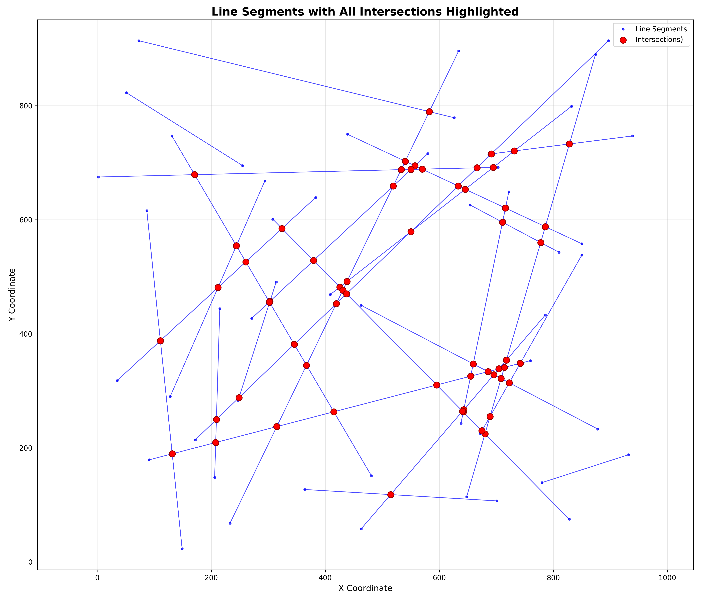

# Geometric Algorithms in C++

This repository is dedicated to implementing a variety of geometric algorithms in modern C++ (C++20). The project is structured for extensibility, allowing new algorithms to be added as separate header files over time.

## Current Features

- **Sweep Line Algorithm for Segment Intersection**  
  Efficiently detects all intersection points among a set of 2D line segments using an event-driven sweep line approach.

  

## Work in Progress

- **Delaunay Triangulation**  
  Implementation of Delaunay triangulation for a set of points in 2D space. This will allow efficient mesh generation and is foundational for many geometric algorithms.

- **Half-Edge Data Structure**  
  A flexible data structure for representing polygonal meshes, enabling efficient traversal and manipulation of mesh connectivity. This will support advanced algorithms and mesh operations.

## Planned Extensions

The repository is designed to grow and each class of algorithms will be implemented in its own header/source file for clarity and modularity.

## Getting Started

### Prerequisites

- **C++20** compatible compiler 
	- Tested with Visual Studio 2022 and g++ 13.3.0
- **CMake** ≥ 3.14

### Build Instructions

1. Clone the repository.
2. Build using CMake

### Running

- Prepare an input file (e.g., `input/line_sweep_input.txt`) with each line containing four numbers: `x1 y1 x2 y2` (segment endpoints).
- The input file will copied to the build directory automatically by CMake.
- Run the executable:
```
   geometric_algorithms.exe
```
- The program will process the input and output intersection statistics.

## Repository Structure

- `geometric_algorithms.cpp` — Main entry point; handles input/output and orchestrates algorithm execution.
- `line_sweep.h` — Sweep line algorithm implementation for segment intersection detection.
- `delauney.h` — (WIP) Delaunay triangulation algorithm implementation.
- `common.h` — Common types, utilities, and geometric primitives shared across algorithms.
- `CMakeLists.txt` — Build configuration; defines how the project is built using CMake.
- `vcpkg.json` — Declares external dependencies managed by [vcpkg](https://github.com/microsoft/vcpkg); currently empty but ready for future package requirements.
- `vcpkg-configuration.json` — Configures vcpkg behavior for this project, such as registries or overlay ports.
- `CMakePresets.json` — Contains CMake build and configure presets for consistent builds across environments and IDEs.


## Contributing

Contributions are welcome! Please add new algorithms as separate header/source files and update the README with usage instructions.

## License

This project is provided for educational and research purposes.
